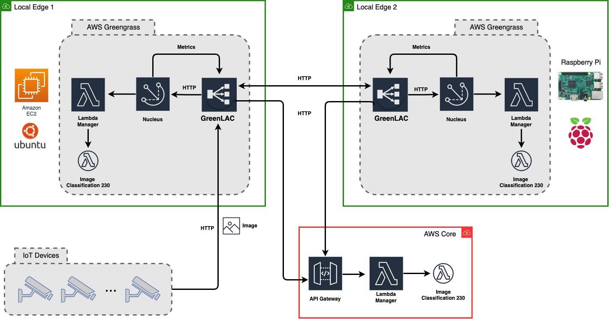

# GreenLAC
The AWS Greengrass Lambda Autoscaler Core (GreenLAC) is a load balancer and reverse proxy for supporting serverless deployments of edge-core IoT applications with AWS Greengrass.
GreenLAC enablers applications on resource-constrained edge nodes to leverage neighbours edge nodes and the core cloud for real-time processing of workloads.

## Architecture
GreenLAC is an [AWS Greengrass Component](https://github.com/aws-greengrass/aws-greengrass-software-catalog#community-components) that will 
soon be available to the dev community. It uses the core component of Greengrass, Nucleus, to forward requests to local Lambdas managed by the 
Lambda Manager. Greengrass scales out Lambdas in the core cloud whenever its local resources reach saturation, and it can also send requests to
other edge nodes. 


## Build Instruction
The build process of GreenLAC is the same used for any AWS Greengrass component. 
### Download
```
git clone https://github.com/pacslab/GreenLAC.git
```

### Prerequisite Setup
- AWS Greengrass Nucleus (Core)
- AWS Greengrass LambdaManager
- AWS Greengrass CLI

### Build From Source
Please make sure Java 11 and Maven 3 are installed before building the package. To build package, run:

```
mvn clean package
```

You need to upload the ``greenlac.jar`` to an S3 Bucket on AWS.

## Component Deployment on AWS 
We have provided the JSON recipe for deployment [here](https://github.com/pacslab/GreenLAC/blob/main/greengrass/deployment.json). Please make sure to 
change any configuration and parameters according to your deployment needs. Below you can see some of the many configuration parameters of 
GreenLAC
```json
  "ComponentConfiguration": {
    "DefaultConfiguration": {
		"greenlac.endpoint.core": "https://gydrsqutj5.execute-api.us-east-1.amazonaws.com/default/230mb_model_1_image",
		"greenlac.scaling.policy": "core-edge-pc",
		"greenlac.scaling.utilizationThreshold.cpu": 50,
		"greenlac.loadBalancer.buffersize": 100,
        [...]
    }
  }
```
## Log Debug
Logs are stored in the default Greengrass folder inside the device which is running the Greengrass core component.
For GreenLAC log, check /greengrass/v2/logs/GrenLAC.log
```log
2022-02-23T01:36:25.149Z [INFO] (Copier) GreenLAC-a: stdout. [30m2022-02-23 01:36:25,147 INFO  [http-nio-8080-exec-18] com.jaimedantas.greenlac.loadbalancer.Lambda: Sending request to: https://gydrsqutj5.execute-api.us-east-1.amazonaws.com/default/230mb_model_1_image. {scriptName=services.GreenLAC-a.lifecycle.Run, serviceName=GreenLAC-a, currentState=RUNNING}
2022-02-23T01:36:25.159Z [INFO] (Copier) GreenLAC-a: stdout. [30m2022-02-23 01:36:25,156 INFO  [scheduling-1] com.jaimedantas.greenlac.monitor.Metrics: CPU: 2.5 % - Memory: 7.998381370355275 %. {scriptName=services.GreenLAC-a.lifecycle.Run, serviceName=GreenLAC-a, currentState=RUNNING}
2022-02-23T01:36:25.184Z [INFO] (Copier) GreenLAC-a: stdout. [30m2022-02-23 01:36:25,181 INFO  [http-nio-8080-exec-20] com.jaimedantas.greenlac.controller.Controller: Request to ml endpoint - 87e86207-218f-4b9c-afb3-5974b811bede. {scriptName=services.GreenLAC-a.lifecycle.Run, serviceName=GreenLAC-a, currentState=RUNNING}

```
## Citation
This is work is currently under review. Please cite this work as followed:

Jaime Dantas, Hamzeh Khazaei and Marin Litoiu. 2022. GreenLAC: Resource-Aware Dynamic Load balancer for Serverless Edge Computing Platforms with AWS Greengrass. Source code: 
[https://github.com/pacslab/GreenLAC](https://github.com/pacslab/GreenLAC)

## License
This project is licensed under the MIT License - see the [LICENSE](LICENSE) file for details.

